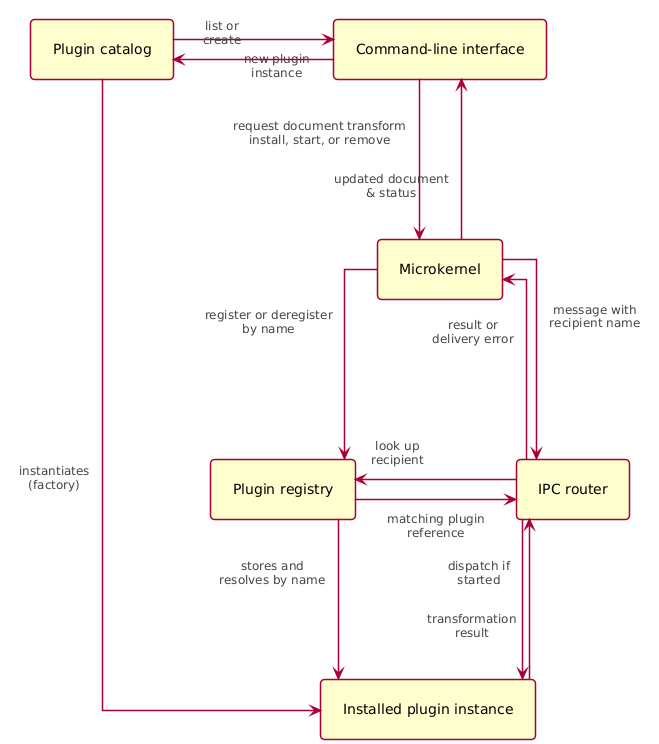

## Also known as

* Plug-in architecture

## Intent of Microkernel architecture Design Pattern

Separate an application's minimal core from optional features so functionality can be added, replaced, or removed through plugins without changing the core. This provides extensibility while keeping specialized processing isolated from general application logic.

## Detailed Explanation of Microkernel architecture Pattern with Real-World Examples

Real-world example

> An IDE can provide a basic editor as its core while installing language tools, debuggers, and integrations as plugins. Likewise, a document-processing application can route documents to format-specific converters. In an insurance claims system, plugins can encapsulate state-specific rules without complicating the core claims workflow.

In plain words

> The microkernel provides the essential services and lets independent plugins supply optional capabilities through a small shared interface. The core manages plugin registration, lifecycle, and communication, while each plugin owns its specialized behavior.

Architecture



The plugin class structure is documented separately in [microkernel-architecture.png](etc/microkernel-architecture.png).
## Programmatic Example of Microkernel architecture Pattern in Java

This example is an interactive text editor. The `MicroKernel` owns the document buffer and plugin lifecycle. The `PluginCatalog` supplies plugin factories, and the `PluginRegistry` keeps track of installed plugins. To transform the document, the kernel packages the document text in a `Message` and sends it through the `IpcRouter`; the selected plugin returns the transformed text.

Every plugin follows a common contract:

```java
public interface Plugin {
  String getName();
  String getDescription();
  void initialize(IpcRouter ipcRouter);
  void onStart();
  void onStop();
  boolean isStarted();
  String handleMessage(Message message);
}
```

The kernel routes a transformation request without depending on the implementation of the plugin:

```java
public String transformDocumentWithPlugin(String pluginName) {
  Message message =
      new Message("Kernel", pluginName, "TRANSFORM", documentBuffer.toString());
  String transformedText = ipcRouter.sendMessage(message);

  clearDocument();
  documentBuffer.append(transformedText);
  return "Success: Document transformed by " + pluginName;
}
```

Plugins such as `UppercasePlugin` and `RemoveSpacesPlugin` implement the contract and handle the `TRANSFORM` action independently. The catalog creates fresh plugin instances from registered factories, while the kernel initializes, starts, and unloads installed plugins.

Start the application and select **Open Text Editor**. Type a few lines, then use `:view`, `:clear`, or `:apply <plugin_name>` to interact with the document. The available plugin list is shown in the install menu.

The example registers plugin factories directly in `PluginCatalog`; a production system could instead discover plugins from configuration, Java's service loader, or a plugin container.

## When to Use the Microkernel architecture Pattern in Java

* Use when building a product with optional capabilities that vary by customer, deployment, or installation.
* Use when extensions should be developed, tested, and released independently behind a well-defined interface.
* Use when volatile custom rules or specialized processing should be isolated from general business logic.
* Avoid it when there are few optional features or when plugins need deep access to core internals; the plugin API and lifecycle add ongoing maintenance costs.

## Architecture Characteristics

* **Agility: High.** Changes can often be isolated to loosely coupled plugin modules.
* **Ease of deployment: High.** Plugins can be installed or updated separately; runtime dynamic loading depends on the implementation.
* **Testability: High.** Plugins can be tested independently, and the core can be tested against plugin contracts.
* **Performance: High.** The application can include only the features needed for a product variant, although routing and plugin boundaries still have costs.
* **Scalability: Low to moderate.** A microkernel is commonly deployed as a single application, so large-scale distribution is not its main strength.
* **Ease of development: Low to moderate.** Plugin contracts, compatibility, lifecycle, and failure handling require deliberate design.

## Real-World Applications of Microkernel architecture Pattern in Java

* IDEs such as Eclipse, which extend core editing capabilities with plugins.
* Internet browsers that add capabilities through extensions.
* Insurance claims processing systems that isolate state-specific rules from general processing.
* Operating systems and product platforms that provide optional or customer-specific modules.
* Data-processing applications that load format-specific readers, writers, or transformations.

## Benefits and Trade-offs of Microkernel architecture Pattern

Benefits:

* Keeps the core small and focused on essential responsibilities.
* Makes optional features replaceable and independently testable.
* Supports product variants without duplicating the core application.

Trade-offs:

* Plugin contracts need compatibility and versioning as the system evolves.
* Plugin discovery, loading, failure handling, and security require deliberate design in production systems.
* Indirection through a registry and message router can make execution flow less obvious than direct calls.
* A single-core deployment may limit horizontal scalability.

## Related Java Design Patterns

* [Strategy](https://java-design-patterns.com/patterns/strategy/): Plugins can provide interchangeable strategies for a core operation.
* [Factory Kit](https://java-design-patterns.com/patterns/factory-kit/): Can help create plugin implementations from configuration.
* [Dependency Injection](https://java-design-patterns.com/patterns/dependency-injection/): Can be used to assemble the core and its plugins.

## References and Credits

* Richards, Mark. *Software Architecture Patterns*. O'Reilly Media, Inc., 2015.
* [Pattern-Oriented Software Architecture, Volume 1](https://www.wiley.com/en-us/Pattern+Oriented+Software+Architecture%2C+Volume+1%3A+A+System+of+Patterns-p-9780471958697)
* [Microkernel architecture style (Microsoft Azure Architecture Center)](https://learn.microsoft.com/en-us/azure/architecture/guide/architecture-styles/microkernel)
